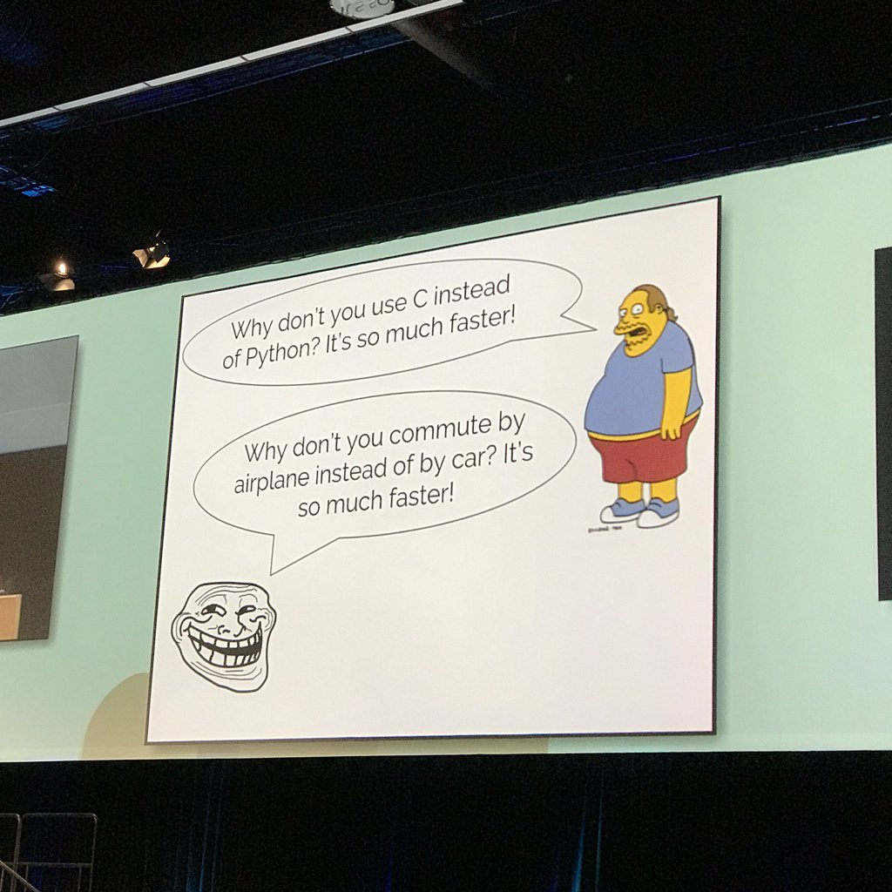

name: inverse
layout: true
class: middle, inverse

---

# Composable libraries for quantum chemistry and other random thoughts

## [Radovan Bast](http://bast.fr)

### [NeIC](https://neic.nordforsk.org)/ [UiT The Arctic University of Norway](https://uit.no)

Text is free to share and remix under [CC-BY-SA-4.0](https://creativecommons.org/licenses/by-sa/4.0/).

Code examples: [MIT license](http://opensource.org/licenses/mit-license.html)

Credits: [Roberto Di Remigio](http://totaltrash.xyz),
         [Ole Martin Bjørndalen](https://github.com/olemb)

---

## Motivation: create tools for the QC community

Most of my action is now on [GitHub](https://github.com/bast).

Very fruitful discussions with [Roberto Di Remigio](http://totaltrash.xyz) on [DevCafe](https://dev-cafe.github.io).

---

layout: false

## DFT computational problem is a nutshell

- Exchange-correlation energy

$$ E\_\text{xc} = \sum\_b w\_b \epsilon\_\text{xc} (n (\textbf{r}\_b)) $$

- Density

$$ n (\textbf{r}) = \sum\_{\kappa\lambda} D\_{\kappa\lambda} \chi\_\kappa (\textbf{r}) \chi\_\lambda (\textbf{r}) $$

- [Numgrid](https://github.com/dftlibs/numgrid): grid $w\_b, \textbf{r}\_b$
- [Balboa](https://github.com/bast/balboa): basis functions $\chi (\textbf{r})$ (and its derivatives)
- Rhodeo (WIP): densities $n$ (and its derivatives)
- [XCFun](https://github.com/dftlibs/xcfun): functional derivatives
- [XCint](https://github.com/dftlibs/xcint): integrator
- [GIMIC](https://github.com/qmcurrents/gimic): gauge-including magentically induced currents
- https://github.com/dftlibs
- http://dftlibs.org
- http://openrsp.org

---

## Motivation for separation

- Separation of concerns
- Smaller units are easier to understand
- They can be developed and tested independently
- Composability
- Libraries can be cherry-picked
- Isolation
- Do one thing, one thing only, and do it well (compare with Unix command line)
- **Minimize the number of libraries affected by point group symmetry and Hamiltonian**
- Better transferability across codes

### [Separation is hard](https://twitter.com/jxxf/status/855486978837446656)

---

## Specs

- Open source license
- Configured with CMake
- Well defined API (iterative process; still learning)
- Semantic versioning
- [Semantic branching model](https://dev-cafe.github.io/branching-model/)
- C interface
- Python interface

---

"Why don't you commute by airplane, it's so much faster?" - [@jakevdp](https://twitter.com/jakevdp) at #pycon2017

---

## Motivations for interfacing with Python

- Fast and easy prototyping
- Leveraging Python packages
- Distribute via PyPI
- Test with pytest
- Simple I/O (e.g. parse input with a one-liner)

---

## There are many ways to interface with Python

- [SWIG](http://www.swig.org)
- [F2PY](https://docs.scipy.org/doc/numpy-dev/f2py/)
- [Boost](http://www.boost.org/doc/libs/1_64_0/libs/python/doc/html/index.html)
- [Cython](http://cython.readthedocs.io)
- [pybind11](https://pybind11.readthedocs.io)
- [CFFI](https://cffi.readthedocs.io)

---

## CFFI example

### Howto

### Advantages

### Disadvantages

### Examples

- https://github.com/dftlibs/numgrid#python-interface

---

## How to include libraries in larger projects

### Git submodules

- Pros:
- Cons:

### Subtrees

- Pros:
- Cons:

### Download/link at build time

- Pros:
- Cons:

---

template: inverse

## If you rewrite the entire code (even in a new language), can you distribute the new code?

## Who is the copyright owner then? Can you relicense?

---

## Clean room design (AKA Chinese wall technique)

- Team A studies the code
- Team B never sees the code
- Team A explains the implementation to team B (specifications are validated by lawyers)
- Team B implements the algorithm based on the specs

### Everything that is not *fair use* or clean room design is derivative work

- Consider this when using or distributing code
- Consider this when choosing a license
- Choose a standard license
- Choose an open source license if you wish to enable derivative work

### You cannot copyright an idea, only an expression of an idea

---

## Outlook/vision

Write me ...

---

## Things I need to improve

- Documentation
- Make it easier to use
- Make it easier to cite
- Publish the code (just putting it out on GitHub is not enough)
- Make it easier to contribute
- Build a inclusive community
