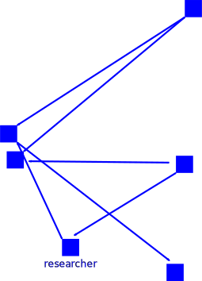
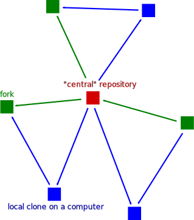
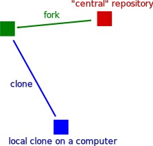

name: inverse
layout: true
class: middle, inverse

---

# Collaborative code review exercise

## [Radovan Bast](http://bast.fr)

### [NeIC](https://neic.nordforsk.org)/ [UiT The Arctic University of Norway](https://uit.no)

Text is free to share and remix under [CC-BY-SA-4.0](https://creativecommons.org/licenses/by-sa/4.0/).

Code examples: [MIT license](http://opensource.org/licenses/mit-license.html)

---

layout: false

## .blue[2017: Are you using peer review in publishing?]

### *Of course! What else?*

---

## .blue[2017: Are you using peer review in publishing?]

### *Of course! What else?*

## .blue[2017: Are you using code review in code development?]

### *I don't know what it is.*
### *I don't know how to do it.*
### *I don't have time to do it.*

---

## .blue[2017: Are you using peer review in publishing?]

### *Of course! What else?*

## .blue[2017: Are you using code review in code development?]

### *I don't know what it is.*
### *I don't know how to do it.*
### *I don't have time to do it.*

## .blue[202X: Are you using code review in code development?]

### *Of course! What else?*

---

class: split-50-50

.column[
## E-mail workflow


]
.column[
## Version control


]

---

class: split-50-50

.column[
## Centralized workflow


]
.column[
## Code review workflow


]

---

## Exercise 1/3

- Form pairs
- Fork the DIRAC central repository
- Clone the forked repository to your laptop
- Create a branch
- Commit a change to the documentation
- Verify the remote with `git remote -v`
- Push the new branch to your fork
- Submit a merge request towards `master` of the central repository;
  add a person from the group to your left as reviewer




---

## Exercise 2/3

- Review the merge request submitted to you
- Possibly request changes
- Once you are happy, accept the change

---

## Exercise 3/3

- **Wait until we have together integrated and discussed all changes**
- Update your fork with the collective changes


(Solution on next page)

---

## Solution for updating your fork

### Longer route

```shell
$ git remote add upstream git@gitlab.com:dirac/dirac.git
$ git fetch upstream
$ git checkout master
$ git merge upstream/master
$ git push origin master
```

### Shorter route

```shell
$ git checkout master
$ git pull git@gitlab.com:dirac/dirac.git master
$ git push git@gitlab.com:you/dirac.git master  # replace "you"
```

---

### Luke Skywalker: .blue[*You know, I did feel something. I could almost see the remote.*]

### Ben Kenobi: .blue[*That's good. You've taken your first step into a larger world.*]

(from Star Wars Episode IV - A New Hope)


## Discussion

- Why is it a bad idea to submit a merge request from the `master` branch?
- What is the advantage of forking workflow compared to branching workflow?
