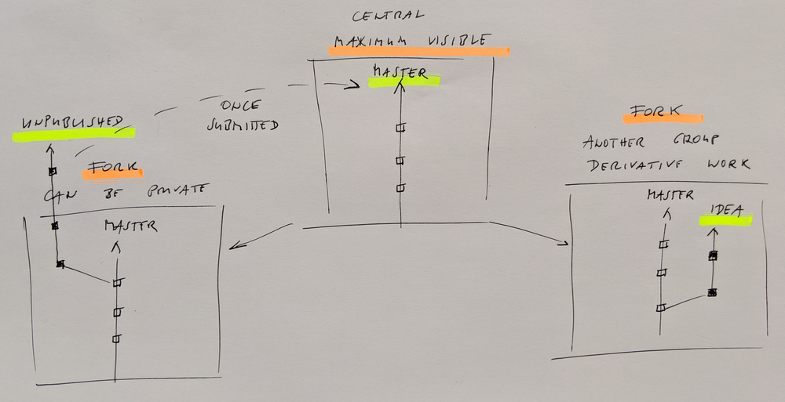
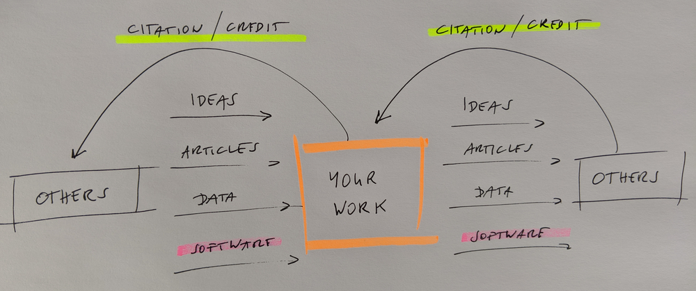

class: center, middle, inverse

# DIRAC and open source, take N

## Radovan Bast [@\_\_radovan](https://twitter.com/__radovan)

Nordic e-Infrastructure Collaboration/
UiT The Arctic University of Norway

---

## What I want to achieve

- I would like the central master is public and licensed under LGPL
- No restrictions for your developments, you can have private feature branches

---

class: center, middle, inverse

## Disclaimer

## - Current state has a history: I am not criticizing past, I want to influence present/future

## - My career will not depend on this discussion and our decisions today

---

## Paper freedom vs. software freedom

### Sharing papers

- We want maximum visibility and maximum reuse.
- The more interesting science is done referencing my paper, the better for me.

### Software freedom

Is the freedom to ...

- ... run the software for .emph[any purpose]
- ... .emph[study] how the software works and to adapt it to your needs
- ... .emph[redistribute] copies of the software
- ... .emph[improve] the software and distribute your improvements to the public

### My view: giving others this freedom is good for us

---

## Typical concerns

.quote["I cannot afford to share my own code"]

- You don't have to, keep it on a private branch.

.quote["I worry that others will copy-paste our code into their programs"]

- Does our current license protect against this?
  Does our current license encourage/require sharing improvements done using our code? No.

.quote["But we already share the sources - what else do you want?"]

- Making sources readable does not mean it's open source. Our license discourages derivative work
  and limits our impact and funding opportunities.

---

## [Unpopular opinion:] Our license is incompatible with open science

This licence for the Dirac program suite (home page http://diracprogram.org) is
valid for all use of the Dirac releases from 12. December 2018.
The Dirac program suite is a free relativistic computational quantum chemistry
program which is available as source code for all who accepts our license
conditions:
1. All research publications including results obtained with Dirac must
   reference the Dirac program as specified on http://diracprogram.org.
2. No part of the Dirac code must be included in other software .emph[without written permission] from the Dirac authors.
3. The Dirac .emph[source code may be modified] for the user's research purposes under
   the conditions that:
   - it is clearly stated in all publications using the modified features that it is from a locally modified version of Dirac
   - the modified Dirac source code .emph[must not be further distributed without permission] from the Dirac authors

### Read this through the eyes of an external research group or funding agency

---

## You have to worry about software licensing

.cite[Idea: R. Darst, adapted]

- In few years "available upon request" and "we have used a locally modified version of DIRAC" will not be publishable.
- Sometimes "OTHERS" are you yourself in the future.

---

## What it would take to open master under LGPL

- Get agreement from all present and past contributors
- Move `MOD_UNRELEASED` code out of master
- Possibly rewrite Git history to get rid of these changes in the past
